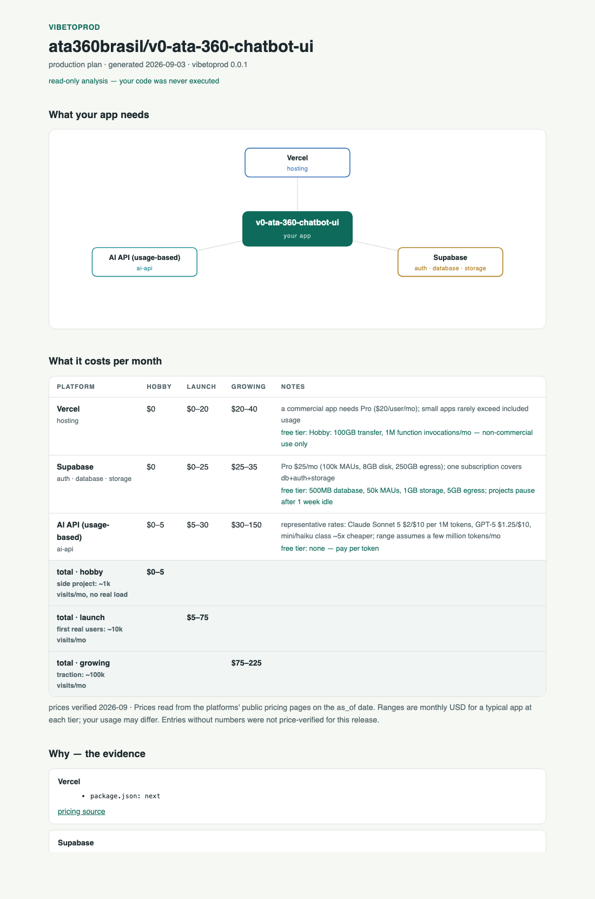

# vibetoprod

**From vibe to production.**

You built your app with Lovable, Bolt, v0 or Cursor. It works on your screen.
`vibetoprod` tells you what it takes to run it for real users — before you
deploy anything:

- **which services** your app actually needs (database, auth, storage, AI APIs, …)
- **what they cost** per month, with the assumptions written down
- **one architecture diagram** of the whole thing, as a self-contained HTML page

```bash
npx vibetoprod your-name/your-repo          # or a local path, or a GitHub URL
```

Real output, real repo:

```text
  vibetoprod — production plan for ata360brasil/v0-ata-360-chatbot-ui

  hosting    → Vercel
             · package.json: next
  database   → Supabase
             · package.json: @supabase/supabase-js
  auth       → Supabase
  storage    → Supabase
  ai-api     → Anthropic API
             · env example declares ANTHROPIC_API_KEY

  estimated monthly cost (prices verified 2026-09):
    Vercel                   $0-20/mo at launch
    Supabase                 $0-25/mo at launch
    AI API (usage-based)     $5-30/mo at launch
    total · hobby            $0-5/mo   (side project: ~1k visits/mo)
    total · launch           $5-75/mo  (first real users: ~10k visits/mo)
    total · growing          $75-225/mo (traction: ~100k visits/mo)
```

Add `--html plan.html` for the full report:



## Why you can trust it

- **Your code is never executed.** Analysis is read-only: no install, no build,
  no postinstall scripts. Remote repos are shallow-cloned with symlinks
  disabled, symlinks are skipped during the scan, and every file read is
  capped at 200KB.
- **Deterministic.** Detection is a [ruleset](rules/ruleset.json) of exact
  file and dependency signals, not an LLM guessing — the same repo produces
  the same plan every run. Tested against a
  [corpus of 33 real vibe-coded repos](docs/corpus.json).
- **Honest numbers.** Every price was read from the platform's public pricing
  page (date-stamped, source-linked in [costs/pricing.json](costs/pricing.json)).
  Platforms we haven't verified say *not priced* instead of a made-up number.
- **Zero dependencies.** Node ≥ 20 and git are all it needs.

## Flags

```text
vibetoprod <local-path | github-url | owner/repo>
  --json           machine-readable output
  --html <file>    write the full plan report (diagram + costs)
```

## What it detects

61 rules across hosting, long-running servers, database, auth, storage,
cache/queue, cron, email, realtime, AI APIs, payments, web3 RPC and search —
from dependency names (exact match), config files, and env-variable names in
`.env.example`-style files. See [docs/spike-2026-09-03.md](docs/spike-2026-09-03.md)
for how the ruleset was built and tested.

Missed something in your repo? That's the most valuable issue you can open:
[report a detection miss](../../issues/new?template=detection-miss.yml).

## Limitations

- Recommendations are a starting point, not gospel — the report shows the
  evidence behind every line so you can judge it.
- Cost ranges assume a typical small app at each tier; heavy usage (video,
  large models, big files) will differ.
- Monorepos with exotic layouts may hide signals; open a detection-miss issue.

## License

MIT. The detection ruleset is seeded in part from AWS's
[deploy-on-aws agent plugin](https://github.com/awslabs/agent-plugins)
(Apache-2.0) — see [NOTICE](NOTICE).
